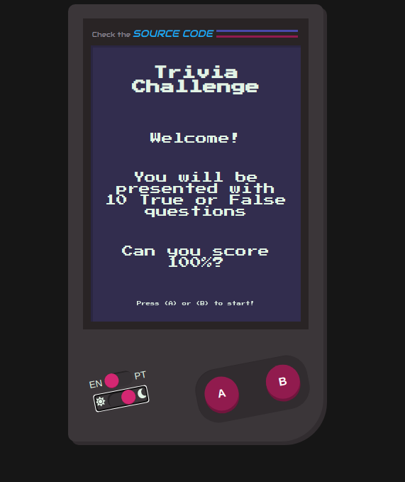

## React TS Trivia Game
Check out the **[online demo](https://douglaswcamargo.github.io/react-ts-trivia-game/)**

#### Overview
This project was developed using:
- `React` + `Typescript`
- `styled-components`
- `i18next`
- `react-redux`
- `redux-saga`
- `react-router-dom`

The `eslint` was configured using the [Standard JS](https://standardjs.com/) style, since it's always a good idea to have a defined coding style right at the beginning of a project.

To manage the state, I've chosen to use `Redux` + `Saga`. Kind of overkill, but JS Generators are cool :)

I've decided to use `styled-components` and it leverages the lib's theming -- there's also a simple "dark mode" switch example. It looks like this:

It uses `i18n` for localization management -- there is an example toggle, but in a real application it would possibly be implemented differently (and, of course, there's also the backend that would require to be translated accordingly...).
Currently, it supports only English and Portuguese (the only ones I know)

I've done some basic testing on the components, but there's room for more...

##### Setup

In order to run this project locally, just `npm install` (or `yarn`) and `npm start`

You can run `npm run lint` to use `eslint` -- if you don't have it configured on your IDE.

